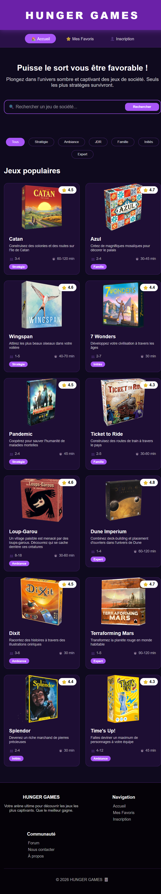

# Projet "Hunger Games"

## Objectif

Créer un site de référencement de jeux de sociétés pour permettre aux utilisateurs de trouver un jeu adapté à leurs envies.

## Compétences visées

### Réaliser des interfaces utilisateur statiques web ou web mobile

- **Compétences** : Développement de pages web en utilisant HTML5 et CSS3, compréhension de la mise en page responsive.
- **Exemple** : Codage en HTML5 et CSS3 pour structurer des pages web et appliquer des styles.

### Développer la partie dynamique des interfaces utilisateur web ou web mobile

- **Compétences** : Programmation en JavaScript, utilisation de bibliothèques et Framework pour enrichir l'interaction utilisateur.
- **Exemple** : Utilisation de JavaScript pour rendre les interfaces interactives.

## Index.HTML

## Structure du projet

## Fonctionnalités

- Affichage en grille responsive (4 colonnes desktop, 1 colonne mobile)
- Recherche de jeux par catégories
- Tri par type de jeux
- Page de détails avec note, nombre de joueurs, durée, catégorie et description
- Design moderne et accessible

## Technologies utilisées

- HTML5 (balises sémantiques)
- CSS3 (Flexbox, Grid, Media Queries)
- JavaScript ES6 (Fetch API, Modules)
- API : DummyJSON (https://dummyjson.com/recipes)

## Installation

`GitHub : https://github.com/Julie130808/Hunger-Games.git`

## Déploiement

## Conception

## Auteur et date de création

CASSAGNES JULIE 
Décembre 2025
Formation DWWM 2025/2026

<!-- ### Etapes 

1. Lister des idées pour la création du site
2. Inspecter d'autres sites de jeux pour voir leurs styles et leur code
3. Faire une maquette Figma du site 
4. Coder celui ci en Html, Css, Js
5. Vérifier le bon focntionnement de celui-ci
6. Vérifier ses performances
7. Remédier aux possibles problèmes et améliorer 
8. Créer un Power Point pour la présentation -->