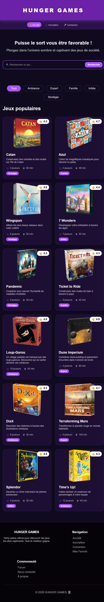
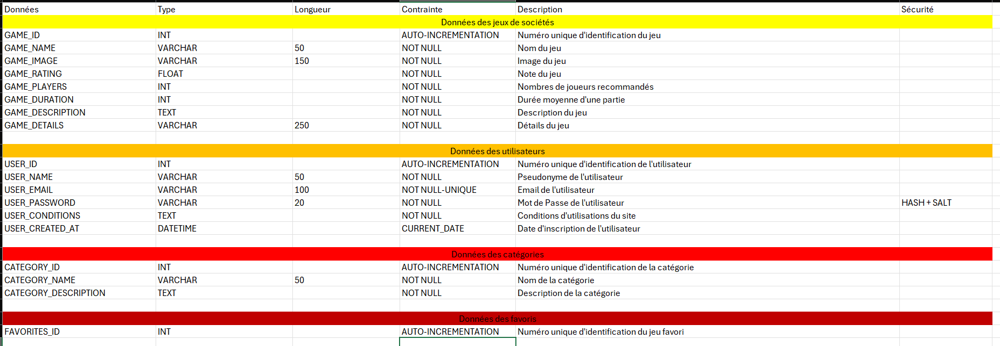
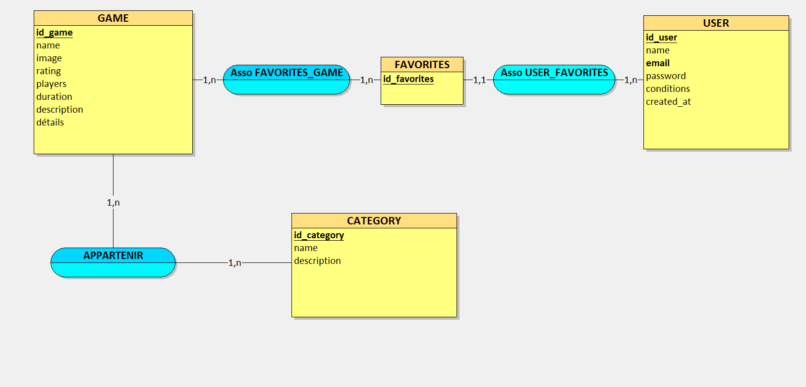
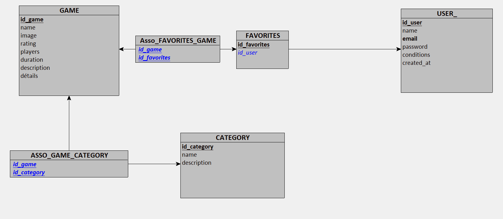
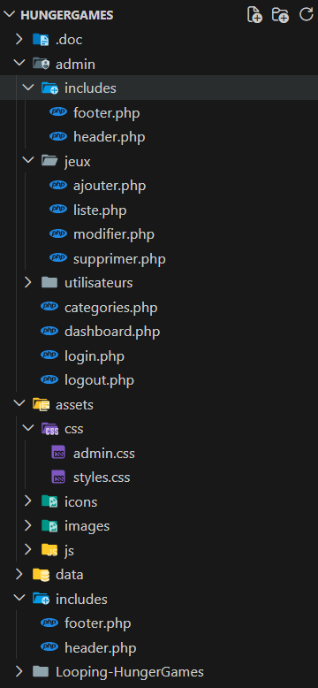
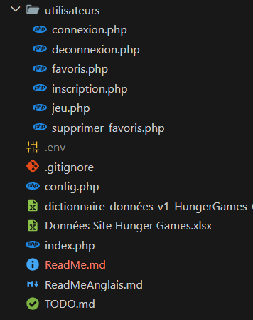

# Projet "Hunger Games"

## Objectif

Créer un site de référencement de jeux de sociétés pour permettre aux utilisateurs de trouver un jeu adapté à leurs envies.

## Compétences visées

### Réaliser des interfaces utilisateur statiques web ou web mobile

- **Compétences** : Développement de pages web en utilisant HTML5, CSS3, compréhension de la mise en page responsive.
- **Exemple** : Codage en HTML5 et CSS3 pour structurer des pages web et appliquer des styles.

### Développer la partie dynamique des interfaces utilisateur web ou web mobile

- **Compétences** : Programmation en JavaScript pour enrichir l'interaction utilisateur.
- **Exemple** : Utilisation de JavaScript pour rendre les interfaces interactives.

### Récupérer, stocker et redistribuer les données à partir d'une BDD

- **compétences** : Programmation en SQL pour récupérer les données et en PHP pour stocker et redistribuer celles-ci.
- **exemple** : Utilisation de SQL pour faire des requêtes permettant la récupération de données.
Utilisation de PHP pour stocker et redistribuer les données.

## Index.PHP

## Structure du projet

- **Dictionnaire de données** :

- **MCD** :

- **MLD** :

- **Arborescence** :

## Fonctionnalités

- Recherche de jeux par catégories
- Tri par type de jeux
- Page de détails avec note, nombre de joueurs, durée, catégorie et description
- Connexion de l'utilisateur 
- Ajout de favoris
- Connexion de l'administrateur
- Gestion des jeux, utilisateurs et catégories

## Technologies utilisées

- HTML5 (balises sémantiques)
- CSS3 (Flexbox, Grid, Media Queries)
- JavaScript (intéractivité)
- SQL (requêtes BDD)
- PHP (serveur)

## Installation

`GitHub : https://github.com/Julie130808/Hunger-Games.git`

## Déploiement

https://julie130808.github.io/Hunger-Games/

## Conception

- **Utilisateur** :

- Index : Présentation des jeux avec catégories
- Jeux : Détails du jeu sélectionné par l'utilisateur
- Inscription : Possibilité de s'inscrire avec un formulaire
- Connexion : Profil utilisateur
- Favoris : Possibilité d'ajouter une liste de favoris

- **Administrateur** :

- Dashboard : Page d'accueil de l'admin
- Login : connexion
- Logout : Déconnexion 
- Jeux : CRUD pour la gestion des jeux
- Utilisateurs : gestion des utilisateurs
- Catégories : gestion des catégories

## Auteur et date de création

- CASSAGNES JULIE 
- Mars 2026
- Formation DWWM 2025/2026